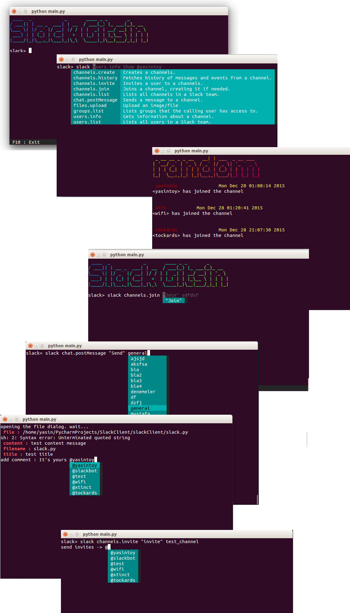
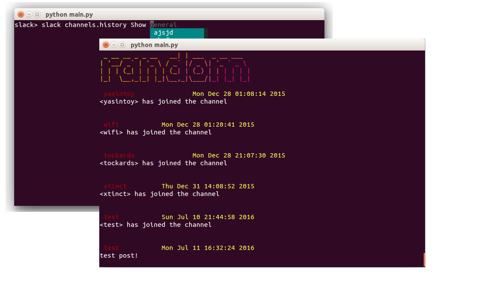
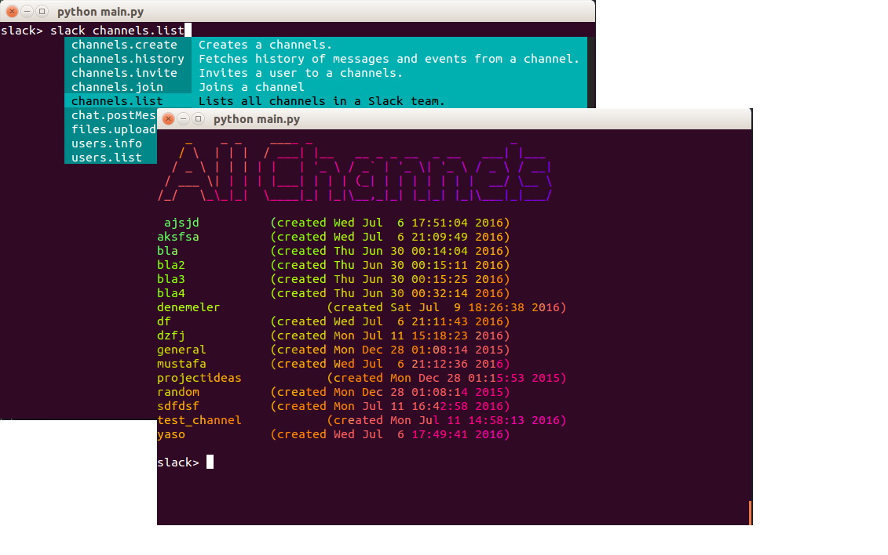

# 

The Problem
=================

> *We have Slack we use in our office using the Windows stand alone since the Chrome based app seems to not show notifications in the bar (highlighting the app when you have a waiting message).*
> *Nearly every day Slack has to be manually closed via task manager (all users at random times) because Slack is taking up nearly all CPU and memory on the PCs.*
> *Is this a known issue and if so is there any solution?*
> *-[Source](https://www.reddit.com/r/Slack/comments/3fy494/slack_taking_up_a_lot_of_system_resources/)

## Are you kidding me? "8 GB ought to be enough for everyone", Don't be ridiculous.

`Let me show you an example : ` A mix of pycharm, slack, vagrant and chrome : 
# 


# 

## Installation

**First, add your slack token to settings.py file**

**For Linux :**
```
git clone https://github.com/yasintoy/Slack-Gitsin.git
cd Slack-Gitsin
sudo apt-get install lolcat figlet zenity
virtualenv -p python2.7 env
source env/bin/activate
pip install -r requirements.txt 

```

**For Mac :** 
```
git clone https://github.com/yasintoy/Slack-Gitsin.git
virtualenv -p python2.7 env
source env/bin/activate
pip install -r requirements.txt
sudo gem install lolcat
brew install figlet zenity

```

**Now, we have notification system for mac/linux**
# 

# 

## TODO 

* [Real time chat](https://github.com/yasintoy/Slack-Gitsin/issues/6)
* [Solve user_info printing](https://github.com/yasintoy/Slack-Gitsin/issues/2)
* [Pagination for showing messages](https://github.com/yasintoy/Slack-Gitsin/issues/4)
* [Solve emoji problem](https://github.com/yasintoy/Slack-Gitsin/issues/3)
* [Make setup.py file](https://github.com/yasintoy/Slack-Gitsin/issues/5)

**Overview with some example screenshots**

# 

## Create channel

   You can easily create a new slack channel by using the `SlackClient`

# 

## Show channel messages

   It shows all slack channels that we have in our team.

# 

## Send a post to channel

   You can send a post to a channel.
   ``TODO : `` we'll add real time chat

# 


## List all Slack channels

  Shows all slack channels that we have in our slack team.

# 

## Join a channel in your slack team


# 


## Upload a file into slack channel

    You can easily upload a file your slack channel by using the `SlackClient`

- First, choice file upload option
# 

- Then, choice file by using the file dialog
# 

- Finally, fill out the screen
# 

