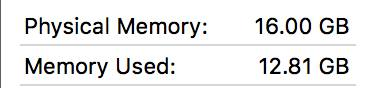
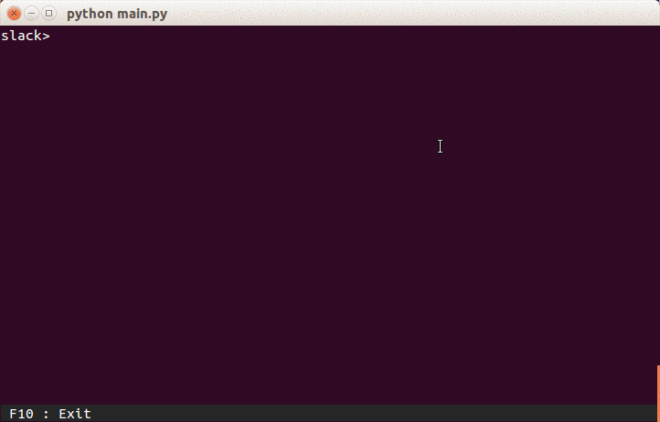
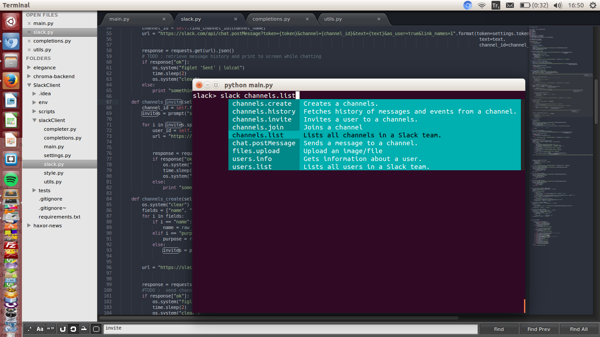
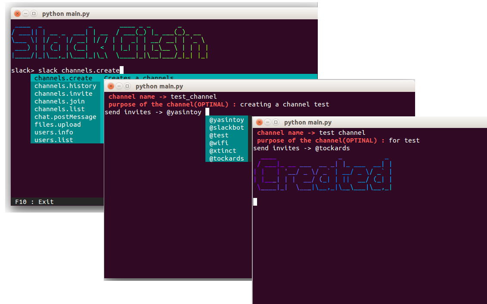
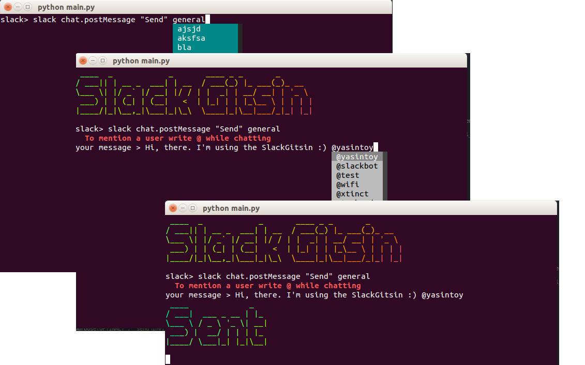
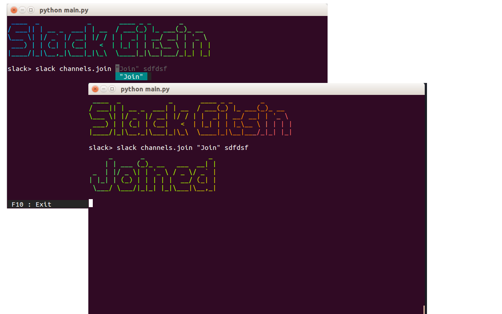
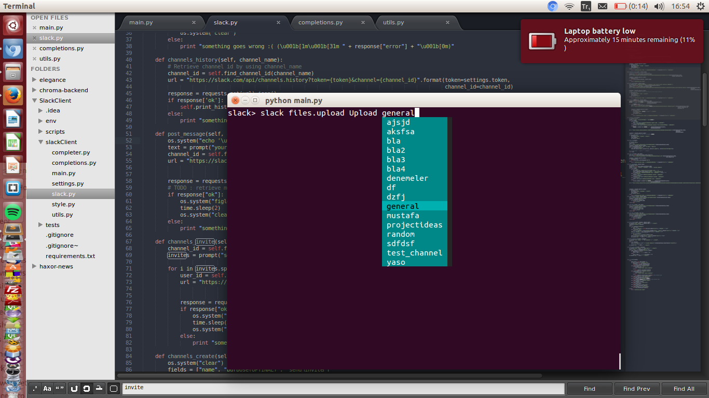
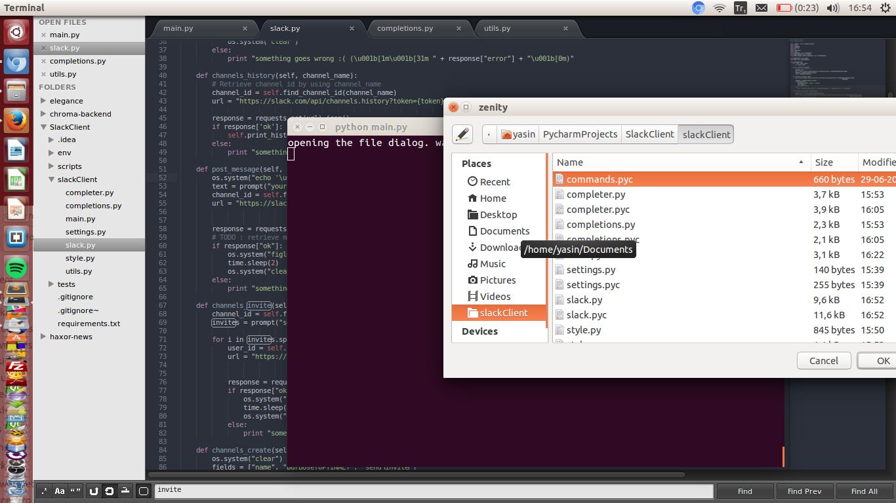
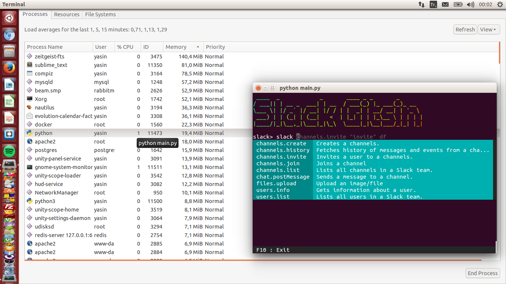
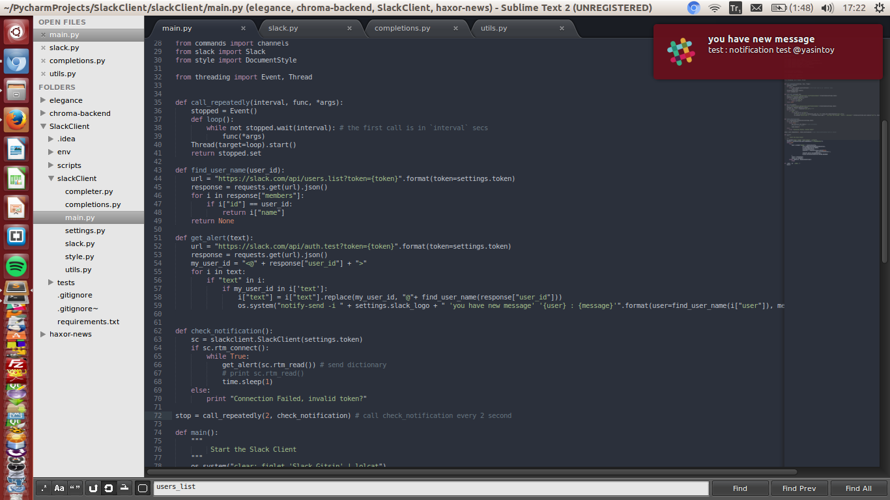

# 

The Problem
=================
> *We have Slack we use in our office using the Windows stand alone since the Chrome based app seems to not show notifications in the bar (highlighting the app when you have a waiting message).*
> *Nearly every day Slack has to be manually closed via task manager (all users at random times) because Slack is taking up nearly all CPU and memory on the PCs.*
> *Is this a known issue and if so is there any solution?*
> *-[Source](https://www.reddit.com/r/Slack/comments/3fy494/slack_taking_up_a_lot_of_system_resources/)

**Are you kidding me? "8 GB ought to be enough for everyone", Don't be ridiculous.**

Let me show you an example: A mix of pycharm, slack, vagrant and chrome:
# 


# 

## Table of Contents
- [Installation](#installation)
- [Getting Started](#getting-started)
- [Features](#features)
- [TODO](#todo)
- [Contributing](#contributing)
- [License](#license)

## Installation

**For Linux :**
```
git clone https://github.com/yasintoy/Slack-Gitsin.git
cd Slack-Gitsin
sudo chmod +x setup-linux.sh
./setup-linux.sh

```

**For Mac :**
```
git clone https://github.com/yasintoy/Slack-Gitsin.git
cd Slack-Gitsin
chmod +x setup.sh
./setup.sh

```
When the installation completes, add your [Slack Token](https://api.slack.com/docs/oauth-test-tokens) to `settings.py`.

## Getting Started

Before start, you should get in the `slack` mode by typing:

```
$ python main.py
```

### List all Slack channels

  ```
  $ slack channels.list
  ```

   It shows all slack channels that we have in our team.

#### 

### Create channel

  ```
  $ slack channels.create
  > channel name -> 
  ```
#### 

### Send a post to channel

  ```
  $ slack chat.postMessage "Send" [CHANNEL_NAME]
  ```

   You can send a post to a channel. *(TODO: we'll add real time chat)*
#### 

### Join a channel in your slack team

  ```
  $ slack channels.join "Join" [CHANNEL_NAME]
  ```
#### 


### Upload a file into slack channel

  You can easily upload a file your slack channel by using the `SlackClient`

- First, say that you want to upload a file:
  ```
  $ slack files.upload Upload [CHANNEL_NAME]
  ```
#### 

- Then, choice file by using the file dialog
#### 

- Finally, fill out the screen
#### 

## Features

### Low Memory Usage
#### 

### Notification System
**We now have notification system for mac/linux**
#### 

## TODO

* [Real time chat](https://github.com/yasintoy/Slack-Gitsin/issues/6)
* [Solve user_info printing](https://github.com/yasintoy/Slack-Gitsin/issues/2)
* [Pagination for showing messages](https://github.com/yasintoy/Slack-Gitsin/issues/4)
* [Solve emoji problem](https://github.com/yasintoy/Slack-Gitsin/issues/3)
* [Make setup.py file](https://github.com/yasintoy/Slack-Gitsin/issues/5)

## Contributing 
- Fork the repo
- Branch it in your development environment (this is required if only you are willing to contribute frequently)
- Hack in
- Make a pull request
- Chill

## License
[GNU GENERAL PUBLIC LICENSE](LICENSE)
